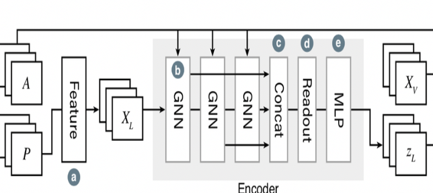

# 空间数据挖掘大作业

## 【摘要】

轨迹数据挖掘一直以来都是研究工作的热点，而且跨度十分广泛，从数据产生，到数据处理，到数据模式挖掘。本文根据可视化的最新成果，提出了一种轨迹矩阵的可视化的方式，为城市可视化，和城市间的对比，以及可视化的解译轨迹数据提供了新的思路。本文主要使用了两种可视化手段，来构建整个轨迹的可视化的系统。其中第一个局部轨迹可视化的手段，是使用经典的嵌入方法，比如node2vec，struc2vec等，这种可视化手段，将某一个轨迹可视化成为低维度空间的节点，从而对outline轨迹节点的寻找，以及轨迹模式的挖掘提供了有效助力，但是这些基于采样的方法并不适用于我们轨迹所面临的情况，大规模计算太难，成本太高，这里我们选择了ProNE方法（2019IJCAI最新图嵌入成果）。而另一个全局轨迹可视化的手段，是使用gcn搭配变分自编码，来寻找一个可以体现城市中所有轨迹的一个更加宏观可视化结果，而且变分自编码的结构也为这种可视化的可解释提供了更好的支撑。但是由于算力不够，我拿到的路网数据的矩阵轻则30多万节点，多则几百万节点，电脑跑的内存溢出也没有跑出来，所以第二种手段仅提供可执行代码.

##【单个轨迹数据可视化】

####**2.3.1** **【单个轨迹局部可视化综述】**

在这个过程中我最开始使用了node2vec,struc2vec，等方法进行可视化，最开始的时候我用3行 node2vec进行了实验，因为参数太大，电脑跑的太热，内存占用很容易跑爆炸。所以我认为deepwalk，node2vec，struc2vec这种采样的方式肯定不满足要求，于是我选择去寻求一种快速，同时又能够对高维轨迹向量就行快速嵌入的方式。最终，我在最新的2019年的IJCAI论文中找到了ProNE，以下是论文中演示的效果：

****

结果表明它能够在超过100万的节点上工作的很快，而且效果不错，正适合我这种非常稀疏的矩阵。下面是对这种方法伪代码描述。

****

####2.3.2【成果】

（实现见代码，同时附上THU提供的C++代码，它的代码直接进行了mkl的cpu计算的高性能优化）：  

****

****

****

嵌入效果直接跑到崩溃,我的电脑支撑不了这样的可视化。请老师分配算力，这样我本人就可以跑出来了，事后老师如果有算力可以直接联系我。网络可视化（30万node为红色，100万边为黑色）为下图：

****

由于缺少提取的标签数据，所以最后效果只能如上图所示。OSM拿不到地物node的标签数据。

由于缺少label数据，所以接下来的工作无法进行，但是降维工作做的非常出色。

##2.4【轨迹数据全局信息可视化】

####**2.4.1**【综述】

 

我进行轨迹全局信息可视化的idea来自于A Deep Generative Model for Graph Layout这篇论文（由于该论文没有提供代码，需要一行一行自己写），这篇论文对于网络的所有节点的layout属性提供了一个共同可视化，也就是寻找一个向量作为所有节点的全局表征，这篇论文是数据挖掘可视化方向的最新论文。我想我们既然已经拿到了邻接矩阵，同时也拿到了轨迹to graph的矩阵，那么我们就可以有一番作为了。

以下是整个网络的结构：

****

下面分为encoder和outcoder进行分别叙述：

 

****

在结构中，A是路网的邻接矩阵，P是每个node的轨迹属性矩阵(已经pca降维的)，第一步，我们对属性信息进一步的提取特征，也就是128维度继续进行降低维度，也许10-20维度是一个比较好的选择，也就是a标记是一个dense layer，之后我们拿到了每个节点的10-20维度属性（轨迹属性），然后通过一个3层的gcn，在通过一个contact Dense layer（见实现代码），然后在通过一个MLP（多层感知机）我们就拿到了一个轨迹信息的全局的表征。这就是是一个encoder的过程。

如果是一个全局的表征，那么我们通过给zl的每一维度都加上一个one-hot分量，也就是下图中的fusion操作，在经过另一个三层gcn之后，再经过一个三层感知机，然后一层denselayer，经过训练能够恢复原来的。那就说明确实是一个全局表征，他就能够用于可视化的操作。这就是一个decoder的过程。

 

****

然后我花了4天时间来写这个模型，总共19层。很可惜，在本篇文章的这部分，我实现了非常多的代码，为了更好的提升速度，我没有使用keras，而是从头到尾写了自己的代码，一共1000行左右，但是最后这个算法跑的太慢了，因为有gcn层，所以必须一次性把数据feed进去，的计算机不支持这样强度的计算，所以仅仅提供给老师可执行的代码，老师如果有兴趣可以联系我，我们一起把这个工作做完。

####2.4.2【成果】

 

下图即是证明：![图片包含 屏幕截图, 文字  描述已自动生成](/Users/lidan/Desktop/空间数据挖掘/空间数据挖掘大作.[图片包含 屏幕截图  描述已自动生成](/Users/lidan/Desktop/空间数据挖掘/空间数据挖掘大作.部分的代码工作除去注释一共953行，写了3天。

